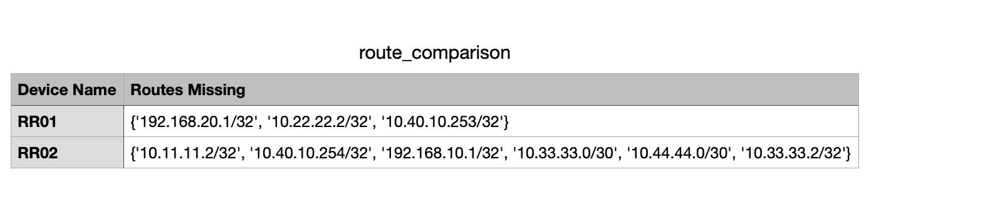
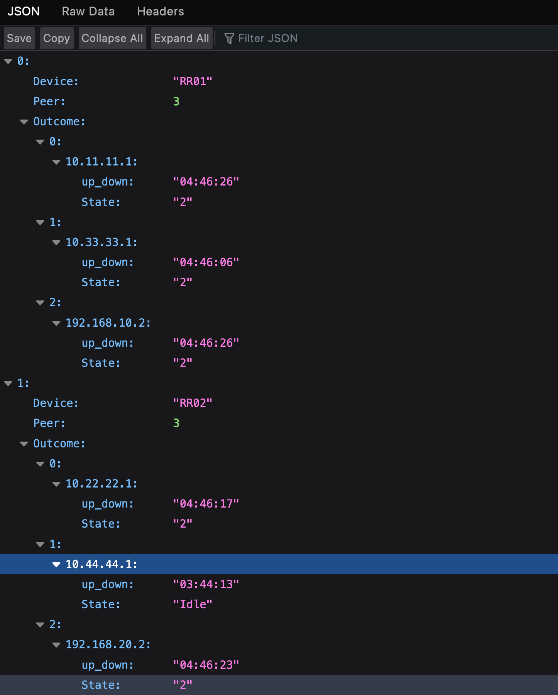
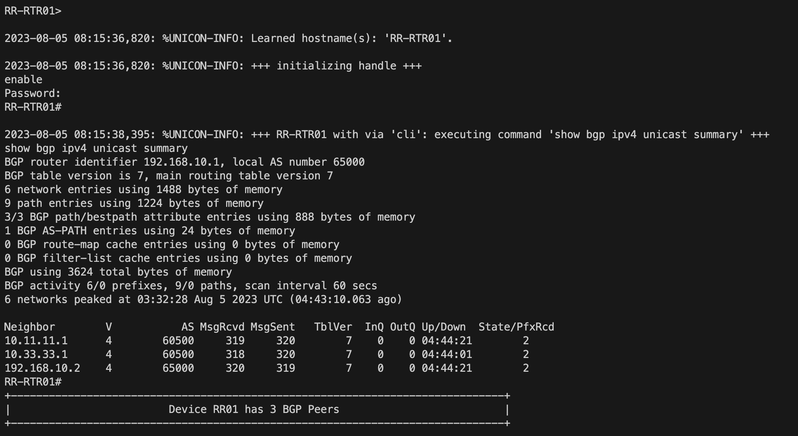

# routereflectorassurance
Using Cisco's PyATS framework to develop Network Assurance testing for BGP route reflectors.

Python Code that allows Network Engineers to run through their existing infrastructure running IOS Software using discovery commands to establish a baseline of the infrastructure state with saved CSV files to show physical connectivity, mac-addresses, etc.
 
## Overview

 Python Code that allows Network Engineers to run through their existing infrastructure running IOS Software using discovery commands to establish a baseline of the infrastructure state with saved CSV files to show physical connectivity, mac-addresses, etc. 

## Use Case Description

This use case is particularly helpful in validating network documentation as well as for Engineers who have joined new networks without any basline documentation as a reference. PYATS's modular methods with parsing makes it incredibly easy to target specific datasets and document within CSV format. 

**Python**

The script is written in python using PYATS to interact with the active devices, a definite set of commands based on experience as well as CSV files to store the outcomes.

**Output**: The results of the commands are stored in individual CSV files. You can also find the raw configuration outputs as well as the exception errors stored in individual text files that would be created after each run.

## Contacts
*Oluyemi Oshunkoya (yemi_o@outlook.com)

## Solution Components
*Python
*Genie
*PYATS
*CML (You will require live routers to perform these tests on)
*IOS XE Routers

## Prerequisites 

Python3.6 and above

CML or live lab environment

## Toolbox

This tool leverages the power of Unicon and Genie libraries from Cisco, which provide a unified way to connect and interact with devices, and to load testbeds respectively. It uses a custom DeviceRoutes class, located in the functions.routes module, to handle route collection and comparison.

The script performs the following tasks:

Loading the Testbed: The testbed details are loaded from a predefined YAML file, enabling the script to access and interact with the devices.

Checking BGP Peers: It checks and collects the Border Gateway Protocol (BGP) peers from the devices in the testbed.

Collecting Routes: The script then collects route details from all the devices.

Comparing Routes: It performs a comparison of the collected routes and stores the result.

Printing and Storing Results: The comparison result is printed to the console and also stored as a Pandas DataFrame. This DataFrame is then exported to a CSV file for easy viewing and further analysis.

Storing BGP Peers: The BGP peers information is stored in a JSON file for future reference.

## Step 1 - Downloading - Option A Using a Docker Image

1. Download and setup docker suitable for your Operating System 
https://docs.docker.com/get-docker/

2. Download the latest version of the PYATS from docker hub

$ docker pull ciscotestautomation/pyats:latest

3. Run the docker image 

$ docker run -it ciscotestautomation/pyats:latest /bin/bash

## Step 1 - Downloading - Option B Using GIT (Assuming your PYATS installation has been done)

1. Clone the repository

git clone https://github.com/yzmar4real/routereflectorassurance.git

2. CD into the directory 

cd routereflectorassurance

3. (Optional) Use the directory as a virtual environment for the project

python3 -m venv . 

4. (Optional) Start the virtual environment and install the requirements for the project

source bin/activate

## Step 2 - Defining the Testbed for devices to be audited

1. Edit Testbed/routes.yaml file to include parameters for your devices. You can connect to the routers in your lab topology. 

## Step 3 - Executing the Script 

1. Execute the main script from console

python3 Scrips/Main.py

## Outputs

